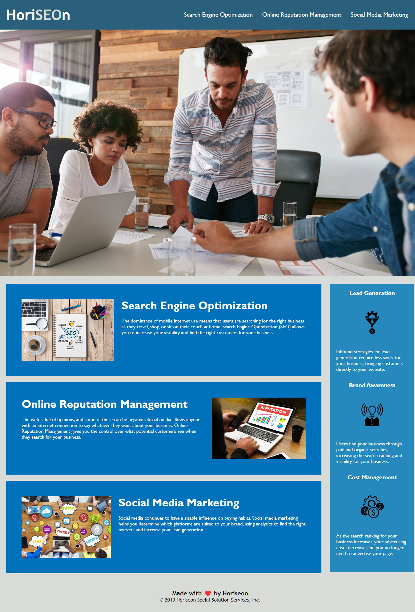

# Module 1 Challenge
### Description
---
This is the completed Module 1 Challenge.  In this challenge, we were required to change the semantics in the tags of the HTML code to make it easier to follow.  I also took away some of the classes that were no longer necessary to make the page less "busy." From there, one id tag was added to make sure the "Search Engine Optimization" link worked correctly.  The only other items I adjusted were the header, I capitalized the letters "SEO" to make it stand out more on the page, and added a picture to the tab.
---

---
https://github.com/sheinen22/Challenge-01.git